# Hello welcome to TasKer

### Optimize Your Daily Routine with TasKer

**TasKer is your personal assistant for staying on top of your daily routine. Easily create and manage tasks, set and prioritize tasks, mark as complete. Whether you're juggling coursework, part-time jobs, or social life, TasKer helps you stay organized and focused.**

## Link to TasKer Site
https://tasker-management-1d7987a02446.herokuapp.com/

The project was created as part of my Capstone project with Code Institute
**Created by Oluwole Akani**

## Contents

1.	[Prioritization](#Priotisation)
2.	[User Story Map](#User-Story-Map)
3.	[MVP features (NOW)](#MVP_Features)
4.	[Impact & Effort](#Impact_&_Effort)
5.	[MOSCOW](#MOSCOW)
6.	[User Stories](#User-Stories)
7.	[Design](#Design)
8.	[Testing](#Testing-Summary)
9.	[Known Bugs](#Known-Bugs)
10.	[Deployment](#Deployment) 
11.	[Credits](#Credits)

## Priotisation
### User Story Map
I decided to prioritize features by listing out potential requirements for a task manager, considering the user personas of those who might need one. I determined that an app focusing on simple task management for people who want to track chores or important dates would be my Minimum Viable Product (MVP).

I outlined these potential features in a user story map. Then, used the Ipact Effort frame work and MOSCOW, I decided which features would be included in the initial release for the MVP, which would come next, and which would be developed later.

#### High level user story
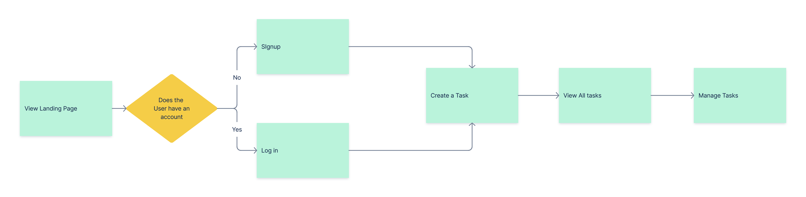

#### User story map and releases
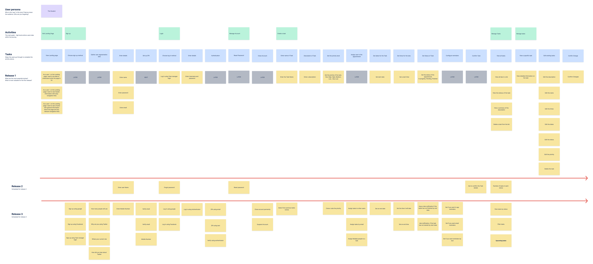

### Impact & Effort
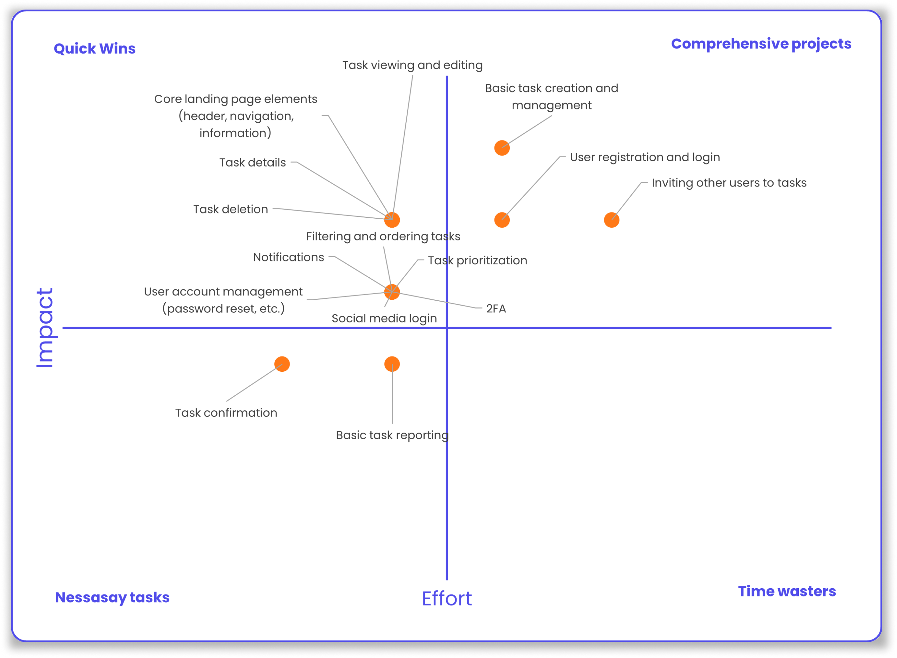

### MOSCOW
The MOSCOW framework helped me categorize further by grouping features into Now, Next, and Later, allowing me to focus on what needs to be built for the initial release. NEXT and LATER stage inititives may change based on user feedback.

### MVP Features
The first release primarily consists of must-have and should-have features. The core focus is on building a foundational task management system with essential user authentication. Additional functionalities can be explored in subsequent releases based on user feedback and project priorities.

### Landing Page
The landing page features a prominent call to action and intuitive navigation with clear buttons to guide users.
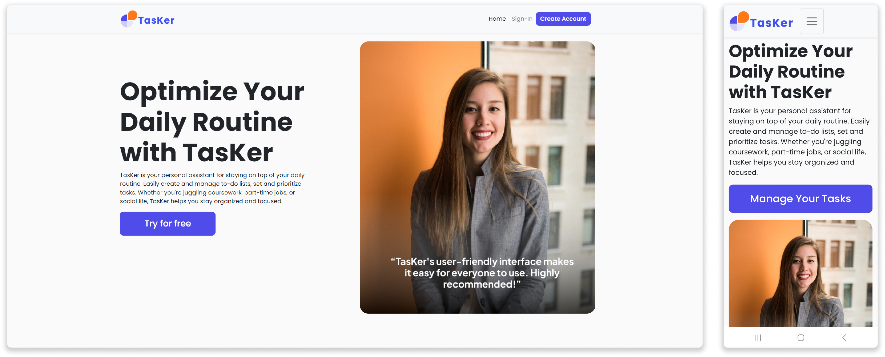

### User Authentication
**Sign In:** Users can access their existing accounts from the landing page.
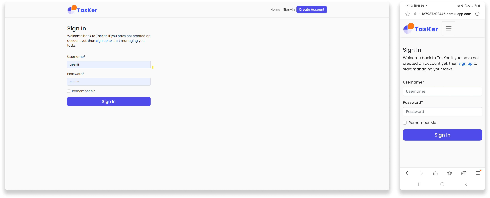

**Sign Up** Users without accounts can create new ones.
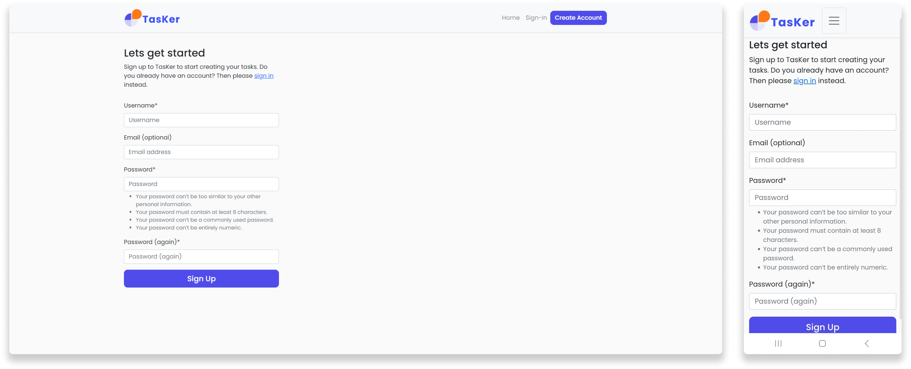

### Task Management
**Dashboard:** Upon login, users are directed to a dashboard where they can add tasks.
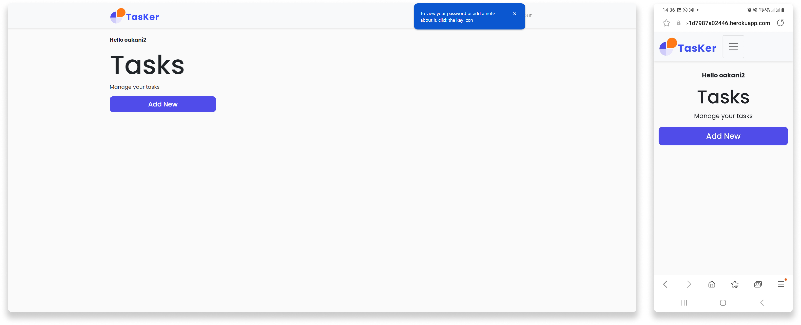

**Task Creation:** Users can create tasks, specifying name, description, priority, time, status, and progress.
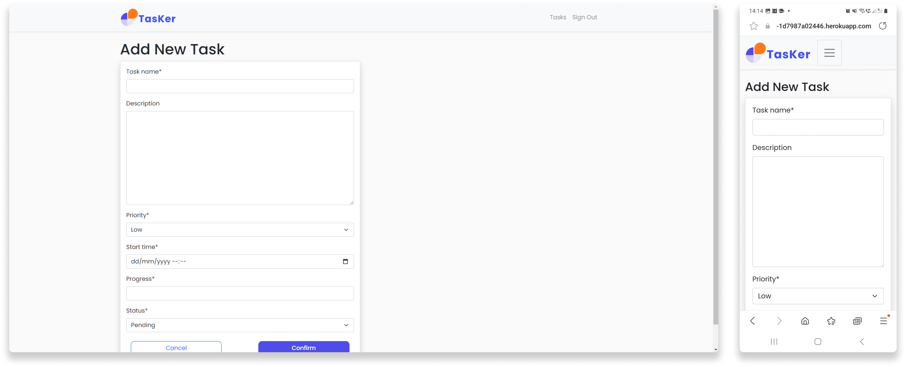

***Task View:** All created tasks are accessible for viewing.
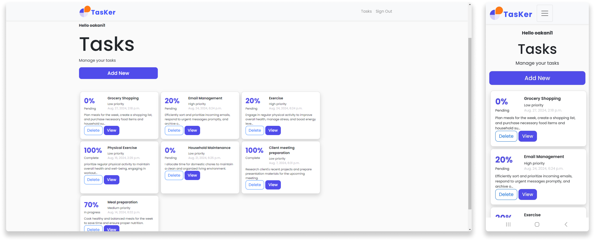

**Task Modification:** Users can edit or delete existing tasks.
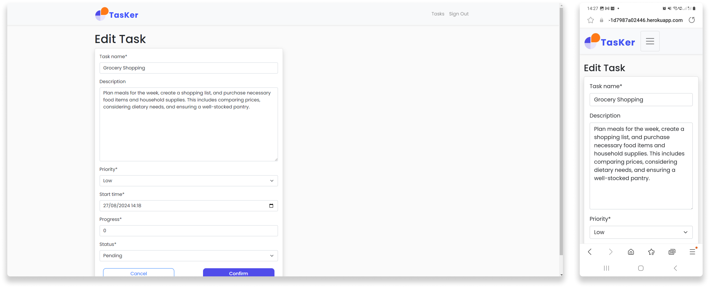
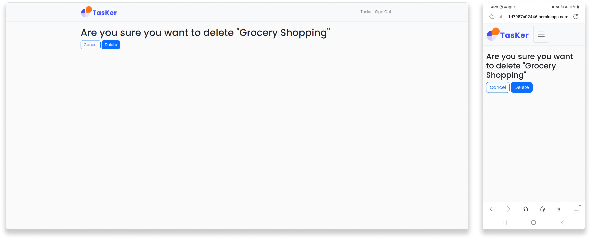

#### NEXT
The subsequent development phase should concentrate on refining the user experience and enhancing task management capabilities. Key areas include
* User Account Management: Implementing robust forgot password and reset password functionalities
* Task Verification: Incorporating a task confirmation process to ensure users are confirming details before adding or editting.
* Providing basic analytics, such as task status counts, to offer insights into task progress

#### LATER
The later phase of development should prioritize features related to user management, task collaboration, and advanced task management capabilities. Key areas include:
**User Management**
* Multiple sign-in options (Google, Facebook, Task Manager)
* Enhanced security features (2FA, account closure)
**Task Collaboration**
* Task assignment to multiple users
* Ability to select from previous task names
**Advanced Task Management**
* Color-coding tasks for prioritization
* Setting end dates and task durations
* Advanced notifications and reminders
* Task filtering and viewing options

#### MOSCOW Table
| Requirement | Priority |
|---|---|
| As a user on the Landing page I want to be able to understand what the page is for | Must have |
| As a user on the Landing page I want to see a header | Must have |
| Information with easy navigation links | Must have |
| As a user I on the Landing page I want to see a footer with general information about the page and any relevant navigation links | Could have |
| Enter user Name | Must have |
| Enter email | Must have |
| Enter password | Must have |
| Log in using Task manager Login | Must have |
| Enter Username and password | Must have |
| Enter Task Name | Must have |
| Enter a description | Should have |
| Set the priority of the task, Very High High Medium Low, Very Low | Could have |
| Set start date | Should have |
| Set a start time | Should have |
| Set the status of the appointment In progress, Pending Finished | Could have |
| View all tasks in a list | Must have |
| View the status of the task | Should have |
| View a summary of the description | Should have |
| Delete a task from the list | Must have |
| View detailed information on the task | Must have |
| Edit the description | Must have |
| Edit the name | Must have |
| Edit the times | Must have |
| Edit the dates | Must have |
| Edit the status | Must have |
| Edit the priority | Must have |
| Delete the task | Must have |
| Reset password | Could have |
| Ask to confirm the Task details | Could have |
| Number of tasks in each status | Could have |
| Sign up using google | Won't have |
| Sign up using Facebook | Won't have |
| Sign up using Task manager login | Won't have |
| How many people in your network | Won't have |
| Why are you using Tasker | Won't have |
| What's your current role | Won't have |
| How did you hear about Tasker | Won't have |
| Enter Mobile Number | Won't have |
| Verify email | Won't have |
| Verify email | Won't have |
| Log in using google | Won't have |
| Log in using Facebook | Won't have |
| Log in using Authenticator | Won't have |
| 2FA using email | Won't have |
| 2FA using text | Won't have |
| Close account permanently | Won't have |
| Suspend Account | Won't have |
| Select from previous tasks names | Won't have |
| Colour code the priority | Won't have |
| Assign tasks to other users | Won't have |
| Assign tasks by email | Won't have |
| Assign Multiple people to a task | Won't have |
| Set an end date | Won't have |
| Set the time & will take to a task | Won't have |
| Set an end time | Won't have |
| Have a late notification if the task has not finished by end date | Won't have |
| late notification, if the task has start by start date | Won't have |
| Set if you want in app reminders | Won't have |
| Set if you want email reminders | Won't have |
| Set If you want reminders by text | Won't have |
| View tasks by status | Won't have |
| Filter tasks | Won't have |
| Upcoming tasks | Won't have |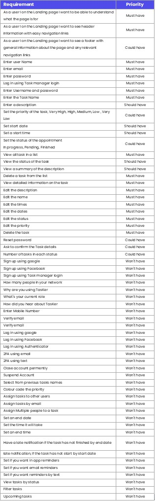

### Impact and Effort
Feature | Impact | Effort | Score |
|---|---|---|---|
| Core landing page elements (header, navigation, information) | 4 | 2 | 8 |
| User registration and login | 4 | 3 | 12 |
| Social media login | 3 | 2 | 6 |
| Basic task creation and management | 5 | 3 | 15 |
| Task viewing and editing | 4 | 2 | 8 |
| Task deletion | 4 | 2 | 8 |
| Task details | 4 | 2 | 8 |
| Task prioritization | 3 | 2 | 6 |
| 2FA | 3 | 2 | 6 |
| Notifications | 3 | 2 | 6 |
| Filtering and ordering tasks | 3 | 2 | 6 |
| Inviting other users to tasks | 4 | 4 | 16 |
| User account management (password reset, etc.) | 3 | 2 | 6 |
| Task confirmation | 2 | 1 | 2 |
| Basic task reporting | 2 | 2 | 4 |

## User Stories
Link to project board
https://github.com/users/Oakani1/projects/3

### Core Functionality

* **Create Task:** As a signed-in user, I want to be able to create a task so that I can track my to-do items.
* **View Tasks:** As a signed-in registered user, I want to be able to view all my tasks so that I can know what is coming up and keep myself organized.
* **Edit Task:** As a registered user, I want to be able to edit a task so that I can update task details as needed.

### User Management
* **Sign In:** As a signed-up user, I want to be able to sign in to my account so that I can access my tasks and profile.
* **User Name Preset:** As a user, I want my username pre-filled when creating a task or not need to fill it in at all.

### Admin Features
* **Admin Control:** As an admin, I want to be able to create a user so that I can control access.

### Landing Page
* **Landing Page:** As a guest, I want to be able to view the landing page and service details so that I can understand the value proposition and decide whether to sign up.

## Design

### Site Goals

**Tasker** aims to simplify task management by providing a user-friendly platform to organize, prioritize, and track personal and professional commitments. The app seeks to enhance productivity and time management by offering a clear and intuitive interface for creating, managing, and completing tasks. 

### Design Choices

The **TasKer** interface prioritizes a clean and minimalist aesthetic with a focus on functionality. Key design elements include:

* **Card-based layout:** Tasks are presented in easily digestible cards for quick scanning and understanding.
* **Progess percentage:** Visual indicators of task completion offer clear progress visualization.
* **Intuitive navigation:** A straightforward menu structure ensures effortless user interaction.
* **Consistent color palette:** A minimalist but bright color scheme enhances visual appeal and improves usability.
* **Clear call-to-actions:** Prominent buttons for adding new tasks and managing existing ones guide user actions. 

### Colour Scheme & Font
**Font used** Poppins

#### Color Pallet
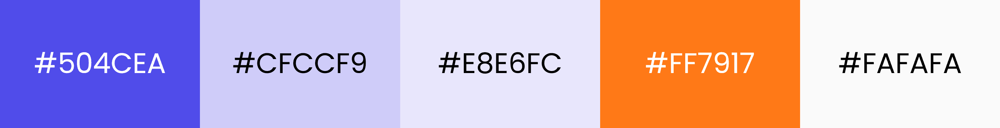

### Wireframes
The design for the MVP had to be changed to accomodate for time, but will be updated as soon as possible to match closer to the Wireframes
#### mid-fidelity
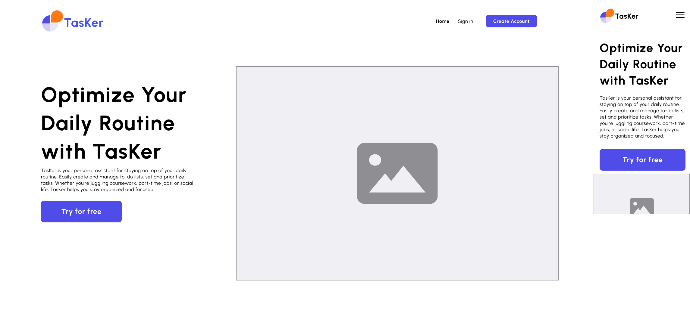
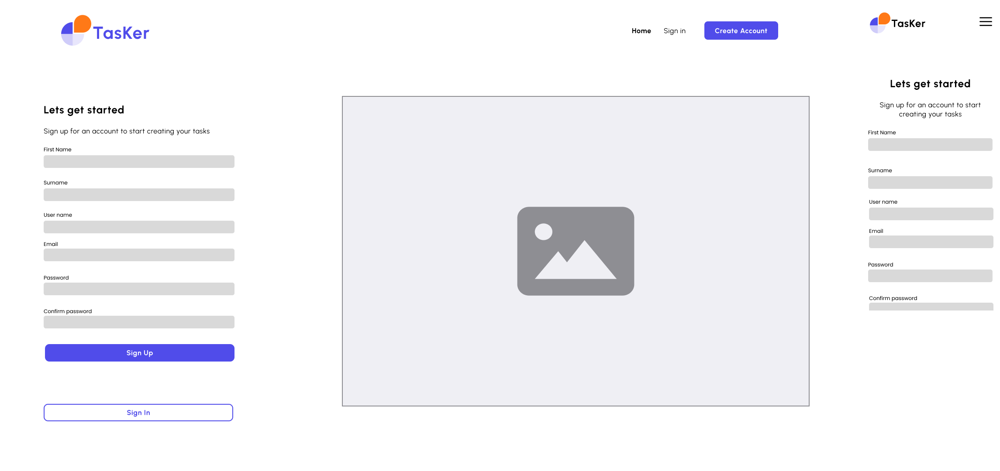
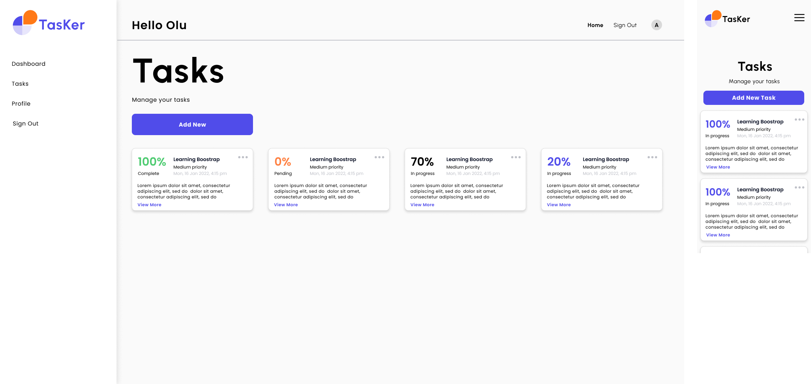

#### High-fidelity
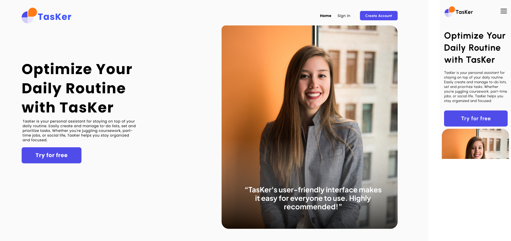
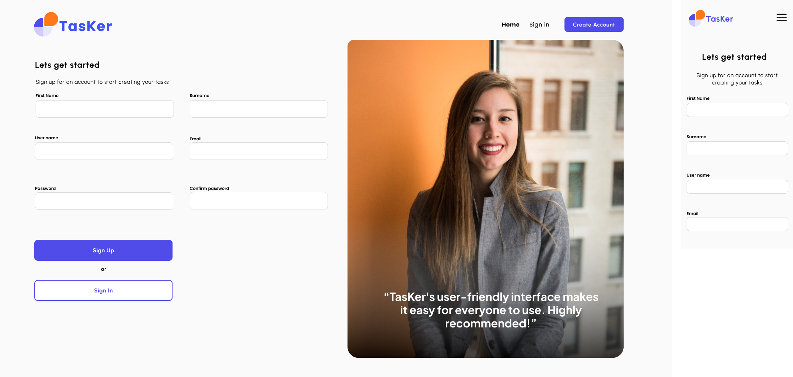
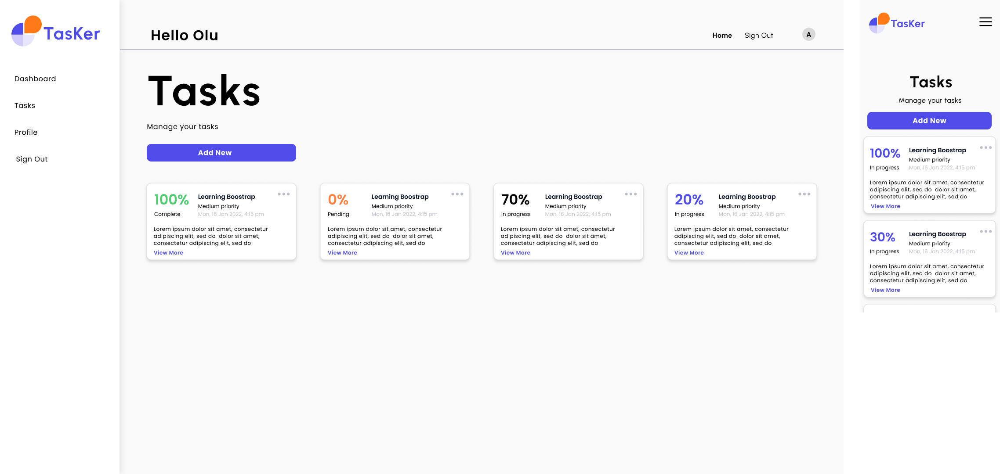

## Testing Summary
this project underwent a comprehensive manual testing process to ensure functionality, accessibility, and performance.

### HTML Validation
The HTML markup was validated using the W3C Markup Validation Service (https://validator.w3.org/). This step confirmed that the HTML code adheres to web standards and best practices. **No errors** were found during this stage.

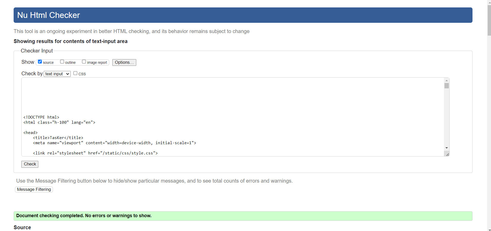

### CSS Validation
The CSS styles were validated using the W3C CSS Validation Service (https://jigsaw.w3.org/css-validator/). This validation ensured that the CSS code is well-formed and compatible with various browsers. **No errors** were identified in the CSS.

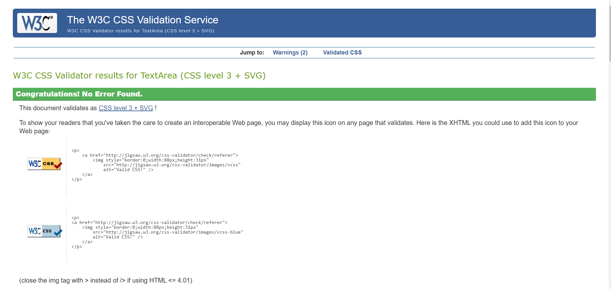

### Python Code Quality
The Python code was evaluated for consistency and style using a Python linter like Pylint (https://pep8ci.herokuapp.com/). This validation ensures the code adheres to Python coding conventions and best practices, improving readability and maintainability. **No errors** were reported by the linter.

### Performance Testing
Lighthouse, a performance auditing tool integrated with Chrome DevTools, was used to assess website performance. Lighthouse analyzes factors like page load speed, responsiveness, and best practices, providing recommendations for improvement.  The followin is an example of a page that was analysed. There seems to be perfoamce issues as i may have not optimised the picture, howere on pages with no picture, the performace is very good

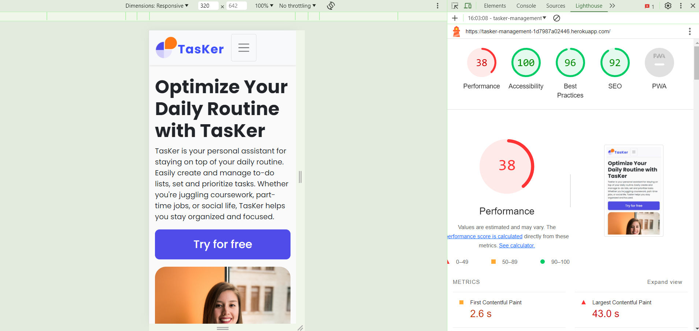
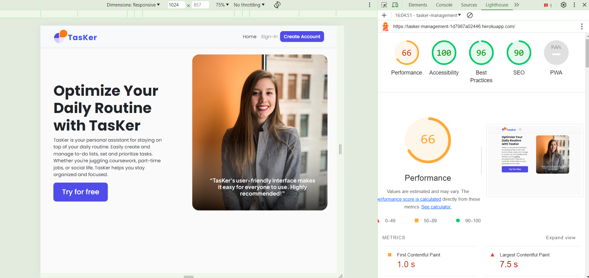
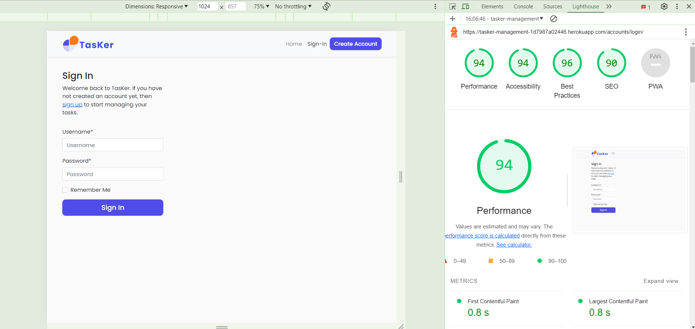

### Accessibility Testing
ChromeVox, a screen reader extension for Chrome, was used to test the website's accessibility for users with visual impairments. This ensured that the website content and functionality are accessible through assistive technologies. **No major accessibility issues** were encountered during this testing phase.

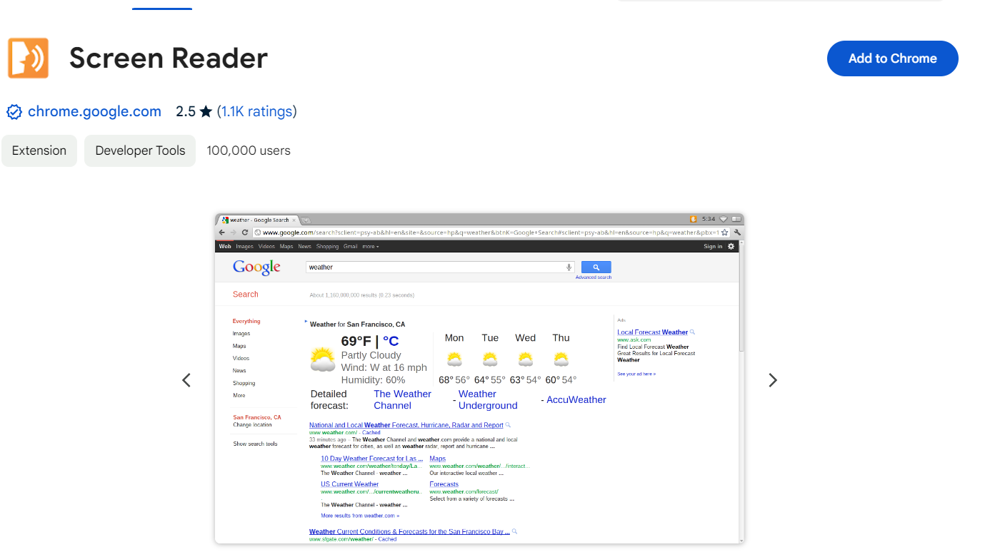

I also used WAVE to perform acceibility test inlcuding ARIA and contrast

### Manual testing
| Test | Outcome |
|---|---|
| Is the purpose of my application obvious to the user? | Pass |
| Can I navigate to where I need to go easily? | Pass |
| Is the information layout logical, and of benefit to the user? | Pass |
| Can I easily read all of the text and quickly identify interactive elements? | Pass |
| Do I know if I'm logged in or not? | Pass |
| Can I register? | Pass |
| Can I log in? | Pass |
| Can I log out again? | Pass |
| Am I Notified when I log in? | Pass |
| Am I Notified when I log out? | Pass |
| Are all of my templates free of errors when I run them through HTML Validation? | Pass |
| Do my css stylesheets pass through Jigsaw with no validation errors? | Pass |
| Is my site responsive and usable across a range of devices/screen widths? | Pass |
| Does my site meet minimum requirements for accessibility & performance? | Pass |
| Can a logged in user create a record on a data table via a frontend form? | Pass |
| Are users notified when a record is created? | Pass |
| Can a logged in user edit a record they have created? | Pass |
| Are users notified when a record is edited? | Pass |
| Can a logged in user delete a record they have created? | Pass |
| Are users notified when a record is deleted? | Pass |
| Is a logged out user restriceted from manipulating another user's records? | Pass |
| Can only authorised users access restricted records/information? | Pass |

### Known Bugs
Navigation menu does not drop down under burger on some screen sizes
No other known bugs

### Later improvements
* These are the quick additions i would make to the sprint
* Add a colour indicator to the status
* Add a side menu bar
* have the edit and create new tasks as pop ups or a slide out tray
* change the priprity setting to buttons

**Overall, the testing process confirmed that the project meets the desired standards for functionality, accessibility, and performance.**

## Deployment
To deploy TasKer application to Heroku the following steps were taken:

1. Create a New Repository:

2. Set up the Development Environment:
* Copy the repository URL into your development environment (e.g., Gitpod).
* Install Django and ensure it’s listed in the requirements.txt file.

3. Prepare for Deployment:
* Create a Procfile in your project directory to specify the web server (e.g., gunicorn).
* Ensure all necessary dependencies are included in the requirements.txt.

4. Create a Heroku App:
* Log in to Heroku and create a new application.
* Name your application and select a region.

5. Connect to GitHub:
* In Heroku, connect your application to the relevant GitHub repository.

6. Configure Environment Variables:
* In the Heroku app settings, add any necessary environment variables, such as the database URL.

7. Deploy the Applications:
* Deploy the application by clicking on 'Deploy Branch' to manually deploy.

8. Launch the Application:
* After deployment launch the app directly from the Heroku dashboard.

### Credits

This section details the resources and frameworks utilized in the development of this project.

**Logo:** The logo was sourced from https://ui8.net/cansaas/products/taskio-task-management-dasboard-ui-kit

**Front-End Framework:** Bootstrap 5 was leveraged to streamline the structure and layout of the destinations page and the homepage, ensuring a responsive and consistent design.

**Sign Up/Sign In Pages:** The HTML structure for the sign-up and sign-in pages was repurposed from Code Institute's "I Think Therefore I Blog" project, with the necessary modifications for functionality.

**Fonts:** Google Fonts were employed to provide a diverse selection of fonts for enhanced visual appeal. 

